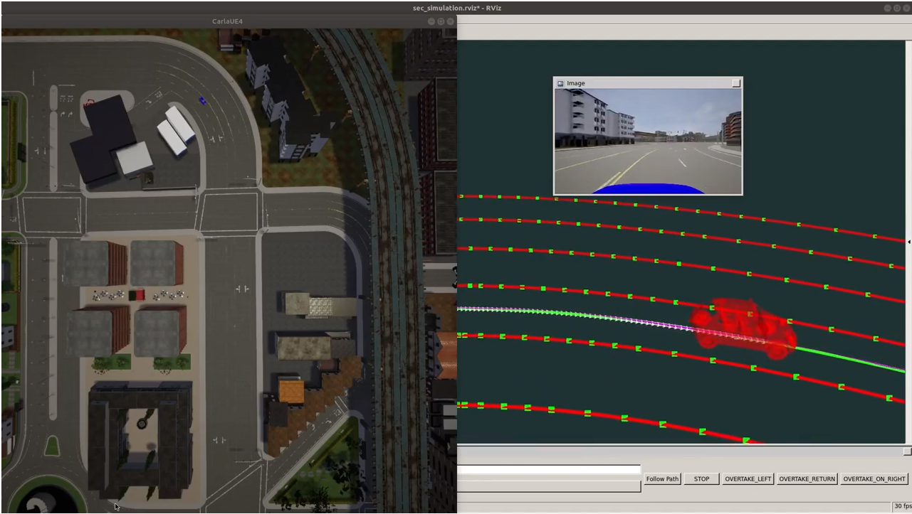

# Waypoint_Tracking_Controller
ROS Package for Road Vehicles Waypoint Tracking.


 
https://youtu.be/5BoiFL1-N8M?list=PLh_tHW0c4RjnWn_UkWFcEjI9zmkVftpbc

## Overview

This ROS package receives as input a set of waypoints and produces control commands for road vehicles to follow these waypoints. 
A spline interpolator generates a smooth path and a speed profiler calculates fordward velocity from a maximum speed specification and the radius of curvature of the path. Lateral control is based on an optimal LQR controller that is easy to adjust. The controller incorporates a delay compensator to minimize the effect of position readings and actuation delays.

## Clone

Clone this repo to your local machine using `https://github.com/RobeSafe-UAH/Waypoint_Tracking_Controller.git`

## Quick Start

>	Install:
  ```
$ sudo apt-get install ros-melodic-waypoint-tracking-controller
  ```

>	Initialize vehicle (or simulator): see the needed interface topics below.

>	Launch controller:
  ```
$ roslaunch waypoint_tracking_controller default.launch
  ```
>	Generate input waypoints (publish them in the waypoints_input topic)

>	Visualization:
  ```
$ rosrun rviz rviz –d default.rviz
  ```
## Nodes

### controller_node

| Topics | Driver link| Message Format | Description |
| ------------- | ------------- | ----------------- | --------------|
| _/waypoints_input_  | Subscriber | nav_msgs/Path | Sequence of input waypoints
| _/absolute_pose_  | Subscriber | nav_msgs/Odometry | Absolute position of the vehicle
| _/external_speed_  | Subscriber | std_msgs/Float64) | External speed specification
| _/spline_  | Publisher | nav_msgs/Path | Interpolated path for display purposes
| _/points_spline_  | Publisher | visualization_msgs/Marker | Decimated waypoints for spline calculation, with minimum distance between points given by min_dist parameter. Useful for visualization purposes
| _/reference_pose_  | Publisher | geometry_msgs/PoseStamped | Reference pose for control
| _/predicted_pose_  | Publisher | geometry_msgs/PoseStamped | Pose predicted by the delay compensator to calculate reference pose
| _/steer_cmd_  | Publisher | std_msgs/Float64 | Front wheel steer angle comand
| _/speed_cmd_  | Publisher | std_msgs/Float64 | Front wheel speed comand
| _/cmd_vel_  | Publisher | geometry_msgs/Twist | Linear and angular velocity command
 
## Params

| Param | Data type | Description |
| ------------- | ------------- | --------------|
| _n_max_  | int | Maximum number of input waypoints
| _min_dist_  |double | Minimum distance between waypoints
| _rc_max_  | double | Maximum value of the radius of urvature that reduces the linear velocity beloww v_max
| _v_max_  | double | Maximum allowed linear velocity fot the vehicle
| lambda_vector_  | list | Vector lambda of normalized weights of the velocity profiler
| _speed_mode_  | int | Mode of combination of external speed specification and internal velocity profiler speed specification
| _Np_  | int | Number of sampling periods estimated for the delay of the localization system
| _Nc_  | int | Number of sampling periods estimated for the delay of the actuation system
| _q11_  | double | parameter of the LQR lateral controller
| _q22_  | double | parameter of the LQR lateral controller
| _R_  | double | parameter of the LQR lateral controller
| _Ts_  | double | Sampling period of the control system


